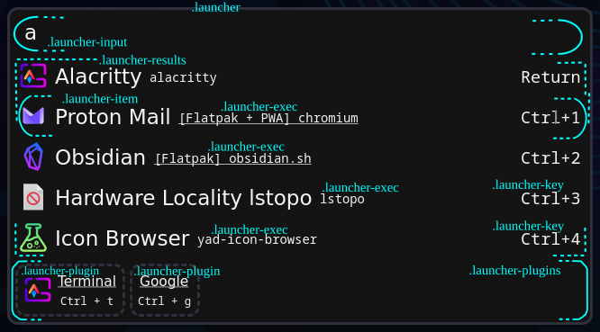

# Config

The main config file is located at `~/.config/hyprshell/config.ron` but can be configured using the `-c` argument. You can also use `.json` and `.toml` as config file formats.
The config is loaded at startup but is reloaded when the file changes.

To generate a default config file with all possible options set, run the following command:

```bash
hyprshell config generate
```

In case this documentation is outdated, or you understand rust, look at the [struct definition](./core-lib/src/config/structs.rs) for the most up-to-date information.

The default values for these configs, which are also the values that get used when generating the config, are located in the code directly above the value definition (`#[default ... ]`).

## Config Options

The config is split into three sections:

- `launcher`: the launcher settings
- `windows`: the window settings

## General Settings

- **layerrules:**_[boolean]_ layerrules are used in hyprland to configure animations modal-view, etc.
  They are currently used in [this part of the code](src/keybinds.rs) to disable the default animations and dim the background around the launcher.

## Launcher Options

This option itself is optional, if not set, the launcher is not shown.

- **default_terminal:**_[string]_ Defined the name of the default terminal to use. This value is optional, if unset a list of [default terminals](./core-lib/src/util.rs) is used to find a default terminal.
  This is used to launch programs like micro from the launcher that need to be run in a terminal.
  This terminal is also used by the `terminal` plugin to run the typed command in a terminal.
- **width:**_[u32]_ The width of the launcher in pixels.
- **max_items:**_[u8]_ Sets the maximum number of items to show in the launcher.
  This does not include the plugin row and only limits the number of items retuned by for examples the application search.
  This value will get reduced to 10 if it is set to a value higher than 10.
- **animate_launch_ms:**_[boolean]_ Milliseconds to wait before the launcher is closed after launching an application or executing a plugin.
- **plugins:**_[Vec\<Plugin\>]_ Array of plugin names to load. The plugins are loaded in the order they are defined in the array.

### Plugins

- **Applications:** Show installed applications in the launcher, filed by the input, sorted by how often they are used. The following options can be provided:
    - **run_cache_weeks:**_[u8]_ How many weeks to cache the run history. This is used to sort the applications by how often they are used.
    - **show_execs:**_[boolean]_ Show the exec line from the Desktop file. In the case of Flatpaks and PWAs these get shortened to the name of the app.
      The full exec can still be seen in the tooltip.
- **Terminal:** Open a terminal and run the typed command in it. The terminal is defined in the `default_terminal` config option. This plugin doesn't accept any options.
- **Shell:** Run the typed command in a shell (in the background). This plugin doesn't accept any options.
- **WebSearch:** Allows searching for the typed query in a web browser. The different search engines can be configured in the options which is an array of `WebSearchEngine` objects.
    - **url:**_[string]_ URL to open in the browser. This must include a `{}` to replace with the searched text.
    - **name:**_[string]_ Name of the search engine. This is used to show the name in the launcher.
    - **key:**_[string]_ Key to use to select this search engine. This is used to register the keybinding to select the search engine without clicking on it.
- **Calc:** Calculates any mathematical expression typed into the launcher. This plugin doesn't accept any options.

## Window Options

- **scale:**_[f64]_ The scale used to scale down the real dimension the windows displayed in the overview. Can be set from `0.0 < X > to 15.0`
- **workspaces_per_row:**_[u8]_ The number of workspaces to show per row in the overview. If you have 6 workspaces open and set this to 3, you will see 2 rows of 3 workspaces.
  Pressing arrow up or down switches between the rows.
- **strip_html_from_workspace_title:**_[boolean]_ Strips the HTML tags from the workspace title.
- **overview:** Configuration for the overview mode.
- **switch:** Configuration for the switch mode.

### Overview Mode Options

This mode displays the windows in a downscaled view of the screen. It also shows the launcher if enabled. This option itself is optional, if not set, this mode is disabled.

- **open:**_[OpenOverview]_ Configuration for opening the Overview mode.
    - **key:**_[string]_ The key to use to open the Overview mode (like "tab" or "alt_r"). This is used to register the keybinding to open the Overview mode.
      If you want to only open using a modifier, set this to the modifier name like `super`. This value is then turned into a modifier keybind like `super_l` as `super` cant be bound as a key.
    - **modifier:**_[MODIFIER]_ The modifier that must be pressed together with the key to open the Overview mode (like ctrl). This MUST be one of these modifiers: `Alt, Ctrl, Super, Shift`.
      DON'T enclose the value in `""` as this is not a string but an enum variant.
- **navigate:**_[Navigate]_ Configuration for navigating the Overview mode.
    - **forward:**_[string]_ The key to use to navigate forward in the Overview mode (like "tab").
    - **backward:**_[Reverse]_ This can either be a separate key like the `~` or can be a modifier like `shift` in combination with the forward key.
      To difference between the two, the provided value must look like this:
        - **key:** `Key("grave")`: Use the key `~` to navigate backward.
        - **modifier:** `Mod(shift)`: Use the `shift` modifier + `navigate>forward` key to navigate backward. DON'T enclose the value in `""` as this is not a string but an enum variant.
- **other:**_[OtherOverview]_ Configuration for the other options in the Overview mode like filtering, etc.
    - **filter_by**_[Vec<FilterBy>]_ Filter the windows by the provided filter. This is a list of `FilterBy` objects.
        - **same_class: Only includes windows of the same class / type. If you currently have alacritty open, only alacritty windows will be shown.
        - **current_workspace: Only includes windows of the current workspace.
        - **current_monitor: Only includes windows of the current monitor.
    - **hide_filtered**_[boolean]_ whether to hide the filtered windows or not. This is used to show the windows that are filtered out by the `filter_by` option.
      If this is set to false, the filtered windows are shown with a grayscale effect.

### Switch Mode Options

This mode displays the windows sorted by their most recent access. This option itself is optional, if not set, this mode is disabled.

- **open:**_[OpenSwitch]_ Configuration for opening the Switch mode.
    - **modifier:**_[MODIFIER]_ The modifier that must be helled down together with the `navigate>forward` key to open the Switch mode (like alt). Letting go of this key will close the Switch mode.
      This MUST be one of these modifiers: `Alt, Ctrl, Super, Shift`. DON'T enclose the value in `""` as this is not a string but an enum variant.
- **navigate:**_[Navigate]_ Configuration for navigating the Switch mode.
    - **forward:**_[string]_ The key to use to navigate forward in the Switch mode (like "tab"). Must be pressed while holding the `open>modifier` key.
    - **backward:**_[Reverse]_ This can either be a separate key like the `~` or can be a modifier like `shift` in combination with the `open>modifier` key and forward key.
      To difference between the two, the provided value must look like this:
        - **key:** `Key("grave")`: Use the key `open>modifier` + `~` to navigate backward.
        - **modifier:** `Mod(shift)`: Use the `shift` modifier + `open>modifier` + `navigate>forward` key to navigate backward. DON'T enclose the value in `""` as this is not a string but an enum variant.
- **other:**_[OtherSwitch]_ Configuration for the other options in the Switch mode like filtering, etc.
    - **filter_by**_[Vec<FilterBy>]_ Filter the windows by the provided filter. This is a list of `FilterBy` objects.
        - **same_class: Only includes windows of the same class / type. If you currently have alacritty open, only alacritty windows will be shown.
        - **current_workspace: Only includes windows of the current workspace.
        - **current_monitor: Only includes windows of the current monitor.
    - **hide_filtered**_[boolean]_ whether to hide the filtered windows or not. This is used to show the windows that are filtered out by the `filter_by` option.
      If this is set to false, the filtered windows are shown with a grayscale effect.

# CSS

The override CSS file is located at `~/.config/hyprshell/style.css` but can be configured using the `-s` argument. The config is loaded at startup but is reloaded when the file changes. (unsetting styles will sometimes not work)

To generate a default override file with all possible classes and CSS variables, run the following command:

```bash
hyprshell config generate
```

The default override file can also be found in [the code](./core-lib/src/config/generate/default.css).

The override file contains many empty classes that can be used to configure padding, fonts, etc.
These settings will take priority over the default values set by the application itself. The application defaults can be found in the CSS files inside the codebase (for example, [this one](./src/default-styles.css) or [that one](./windows-lib/src/styles.css)).

If you want to change colors borders, etc. you can edit the CSS variables in the `:root {}` section.
These styles are automatically used everywhere in the application, so you don't have to set them for every class.



