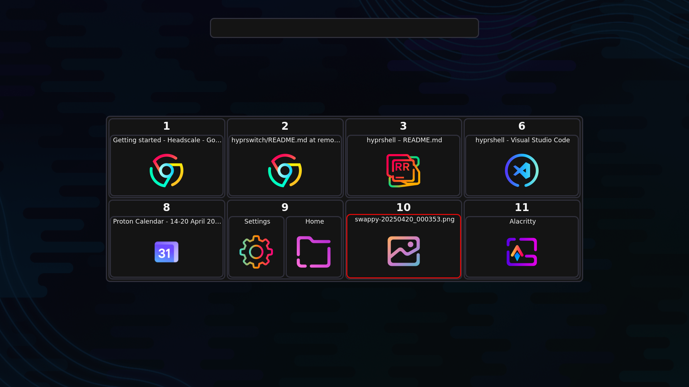
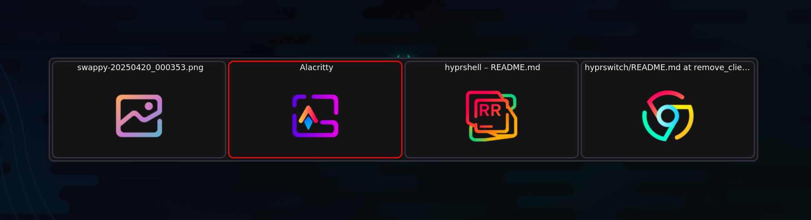
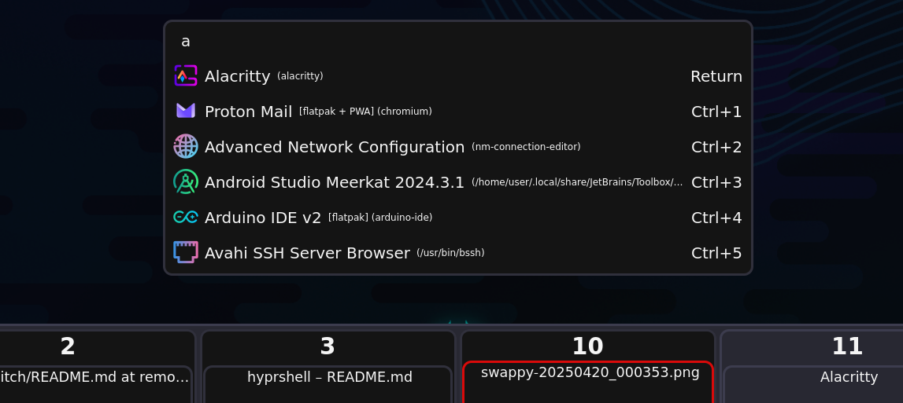

# hyprshell

[](https://crates.io/crates/hyprshell) [](https://docs.rs/hyprshell)



## Overview

hyprshell is a Rust-based GUI designed to enhance window management in [Hyprland](https://github.com/hyprwm/Hyprland).
It provides a powerful and customizable interface for switching between windows using keyboard shortcuts and GUI.
The application also includes a launcher for running applications directly from the GUI.

## Features

- **Window Switching**: Switch between windows using keyboard shortcuts in a GUI.
- **Customizable Keybindings**: Define your own keybindings for window switching and GUI interactions.
- **Config**: Interactive config file generation for easy setup.
- **Launcher Integration**: Launch applications directly from the GUI, sorted by usage frequency.
- **Sorting and Filtering**: windows sorted by position, can be filtered by class, workspace, or monitor.
- **Theming**: Customize the GUI appearance using CSS.
- **Dynamic Configuration**: Automatically reloads configuration/style changes without restarting the application.

## Installation

### From Source

gtk4, [gtk4-layer-shell](https://github.com/wmww/gtk4-layer-shell)[1.1.1] and socat must be installed

```bash
cargo install hyprshell
```

### Arch Linux (TODO Add)

```bash
paru -S hyprshell
# or
yay -S hyprshell
```

### NixOS

- Supported Architectures: `x86_64-linux`, `aarch64-linux`

#### With Flakes

`flake.nix`:

```nix
{
  inputs = {
    nixpkgs.url = "github:nixos/nixpkgs?ref=nixos-unstable";
    hyprshell.url = "github:H3rmt/hyprswitch?ref=hyprshell";
  };

  outputs = { nixpkgs, hyprshell }: {
    nixosConfigurations.hostname = nixpkgs.lib.nixosSystem {
      system = "x86_64-linux";
      modules = [{ environment.systemPackages = [ hyprshell.packages.x86_64-linux.default ]; }];
    };
  };
}
```

#### Without Flakes

`configuration.nix`:

```nix
{pkgs, ...}: let
  flake-compat = builtins.fetchTarball "https://github.com/edolstra/flake-compat/archive/master.tar.gz";
  hyprshell = (import flake-compat {
    src = builtins.fetchTarball "https://github.com/H3rmt/hyprswitch/archive/hyprshell.tar.gz";
  }).defaultNix;
in {
   environment.systemPackages = [hyprshell.packages.${pkgs.system}.default];
}
```

## Usage

Run `hyprshell --help` to see available commands and options.

### Config generation

To generate a default configuration file, run:

```bash
hyprshell config generate
```

This launches an interactive prompt to set up your configuration.
The generated file will be located at `~/.config/hypr/hyprshell.conf`.

### Config validation

To validate your configuration file, run:

```bash
hyprshell config check
```

This checks for any syntax errors or issues in your configuration file andshows a `explanation` of how to use hyprshell.

### Initialization

Add the following to your Hyprland configuration (`~/.config/hypr/hyprland.conf`):

```ini
exec-once = hyprshell run &
```

Or enable the systemd service (generated with `hyprshell config generate`):

```bash
systemctl --user enable --now hyprshell.service
```



