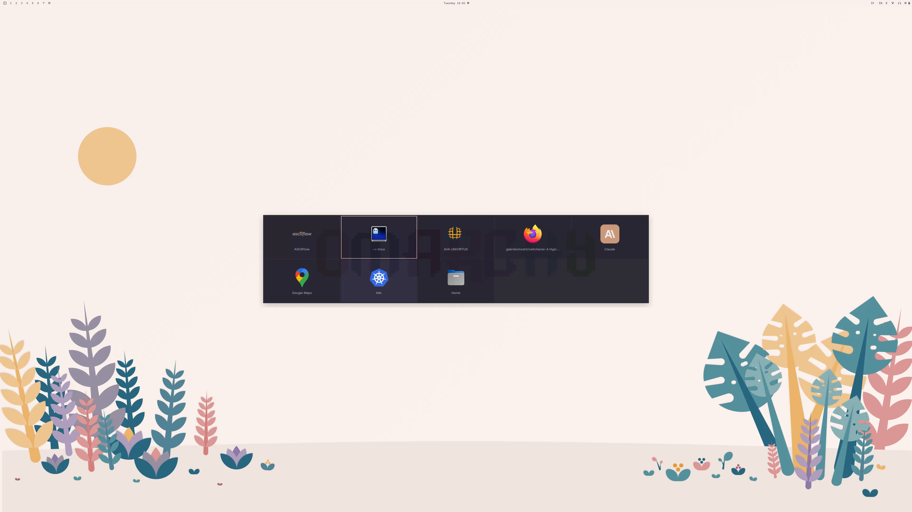

# Switcharoo

> **Note:** This project is a fork of [hyprshell](https://github.com/H3rmt/hyprshell) by [H3rmt](https://github.com/H3rmt) (Enrico Stemmer), licensed under the [MIT License](LICENSE). Hyprshell is a fantastic project with a rich feature set. Switcharoo strips it down to its core window-switching functionality, aiming for a leaner and more focused tool.

[](https://crates.io/crates/switcharoo) [](https://docs.rs/switcharoo)



## Description

Switcharoo is a Rust-based GUI designed to enhance window management in [Hyprland](https://github.com/hyprwm/Hyprland).
It provides a powerful and customizable interface for switching between windows using keyboard shortcuts and GUI.

## Features

- **Window Switching**: Switch between windows using keyboard shortcuts in a GUI.
- **Customizable Keybindings**: Define your own keybindings for window switching and GUI interactions.
- **Theming**: Customize the GUI appearance (gtk4) using [CSS](docs/CONFIGURE.md).
- **Dynamic Configuration**: Automatically reloads configuration/style changes without restarting the application.
- **Debug commands**: [Commands](docs/DEBUG.md) to debug desktop files, icons and default applications.

## Installation

**Minimum hyprland version: 0.52.1**

### Dependencies

- hyprland (with development headers)
- gtk4 (>= 4.18)
- libadwaita (>= 1.8)
- [gtk4-layer-shell](https://github.com/wmww/gtk4-layer-shell) (>= 1.1.1)
- Rust (>= 1.91.0)

**Fedora:** `sudo dnf install gtk4-layer-shell-devel libadwaita-devel hyprland-devel`

**Arch:** `sudo pacman -Sy gtk4-layer-shell libadwaita hyprland`

### Building from source

```bash
git clone https://github.com/gabrielvincent/switcharoo.git
cd switcharoo
cargo build --release
```

Build with fewer features for faster compile times:

```bash
cargo build --release --no-default-features --features "slim"
```

## Usage

Run `switcharoo --help` to see available commands and options.

### Initialization

Enable the systemd service (generated with `switcharoo config generate`) [recommended]:

```bash
systemctl --user enable --now switcharoo.service
```

Or add the following to your Hyprland configuration (`~/.config/hypr/hyprland.conf`):

```ini
exec-once = switcharoo run &
```

### Debugging

Debug commands are provided to help troubleshoot desktop files, icons, and default applications, see [Debug.md](docs/DEBUG.md) for detailed information about available commands and their usage.

### Feature Flags

✅ = included in the default feature set.

✨ = included in the slim feature set. (build with `--no-default-features --features "slim"`)

- `json5_config`✅: Adds support for a json5 config file.
- `debug_command`✅✨: Adds the `switcharoo debug` command to debug icons, desktop files, etc.
- `ci_config_check`: (!used for ci tests) Adds a command to check if the loaded config is equal to the default config or the full config. Also diables loading of configs without all values.

### Env Variables

- `SWITCHAROO_NO_LISTENERS`: Disable all config listeners (config file, css file, hyprland config, monitor count)
- `SWITCHAROO_NO_ALL_ICONS`: Don't check for all icons on fs and just use the ones provided by the `gtk4` icon theme.
- `SWITCHAROO_RELOAD_TIMEOUT`: Set the timeout for reloading the config file in milliseconds (default: `1500`).
- `SWITCHAROO_LOG_MODULE_PATH`: Add the module path to each log message. (use with -vv)
- `SWITCHAROO_NO_USE_PLUGIN`: Disable the use of the hyprland plugin to capture switch mode events.
- `SWITCHAROO_EXPERIMENTAL`: Enables experimental features (grep through the source code for `"SWITCHAROO_EXPERIMENTAL"` to see them)
