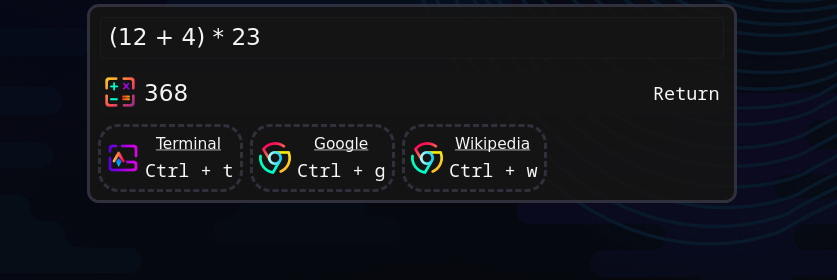

# Hyprshell

[](https://crates.io/crates/hyprshell) [](https://docs.rs/hyprshell)


## Overview

Hyprshell _(previously hyprswitch)_ is a Rust-based GUI designed to enhance window management in [Hyprland](https://github.com/hyprwm/Hyprland).
It provides a powerful and customizable interface for switching between windows using keyboard shortcuts and GUI.
The application also includes a launcher for running applications, doing calculations, etc.

## Features

- **Window Switching**: Switch between windows using keyboard shortcuts in a GUI.
- **Customizable Keybindings**: Define your own keybindings for window switching and GUI interactions.
- **Config**: Interactive [config file](docs/CONFIGURE.md) generation for easy setup.
- **Launcher Integration**: Launch applications directly from the GUI, sorted by usage frequency.
- **Launcher Plugins**: Different plugins like Web search, actions or calculations can be enabled.
- **Theming**: Customize the GUI appearance (gtk4) using [CSS](docs/CONFIGURE.md).
- **Dynamic Configuration**: Automatically reloads configuration/style changes without restarting the application.
- **Debug commands**: Many [Commands](docs/DEBUG.md) to debug desktop files, icons and default applications.

## Installation

[](https://repology.org/project/hyprshell/versions)

### Arch Linux (AUR)

```bash
paru -S hyprshell
# or
yay -S hyprshell
```

Use `hyprshell-bin` for the pre-built binaries from github releases.

Use `hyprshell-slim` for the [slim](#feature-flags) version (faster buildtime).

### Binary pre-built packages (only for x86_64 and aarch64)

Download and extract from the latest release on the [releases](https://github.com/h3rmt/hyprshell/releases) page.

### NixOS

This repository contains a `flake` and with a type-save `home-manager` module for configuration.

Hyprshell is also available in `nixpkgs` repository and can be configured using a generic `home-manager` module.

More information can be found in the [NixOS](docs/NIX.md) section.

### From Source

hyprland, libadwaita and [gtk4-layer-shell](https://github.com/wmww/gtk4-layer-shell)[1.1.1] must be installed

```bash
cargo install hyprshell
```

Less features in [slim](#feature-flags) mode

```bash
cargo install hyprshell --no-default-features --features "slim"
```

**hyprland-devel is needed for the hyprland headers (needed to build hyprland plugin)**

Fedora: `sudo dnf install gtk4-layer-shell-devel libadwaita-devel hyprland-devel`

Arch: `sudo pacman -Sy gtk4-layer-shell libadwaita hyprland`

Minimum required rustc version: `1.87.0`

## Usage

Run `hyprshell --help` to see available commands and options.

### Config generation

To generate a default configuration file, run:

```bash
hyprshell config generate
```

This launches an interactive prompt to set up your configuration.
The generated file will be located at `~/.config/hyprshell/config.ron`.

If you want to modify these settings, look at the [Documentation](docs/CONFIGURE.md) for the config file.

### Config validation

To validate your configuration file, run:

```bash
hyprshell config explain
```

This checks for any syntax errors or issues in your configuration file and shows a `explanation` of how to use hyprshell.

### Initialization

Enable the systemd service (generated with `hyprshell config generate`) [recommended]:

```bash
systemctl --user enable --now hyprshell.service
```

Or add the following to your Hyprland configuration (`~/.config/hypr/hyprland.conf`):

```ini
exec-once = hyprshell run &
```




### Debugging

Debug commands are provided to help troubleshoot desktop files, icons, default applications and launcher functionality, see [Debug.md](docs/DEBUG.md) for detailed information about available commands and their usage.

### Feature Flags

✅ = included in the default feature set.

✨ = included in the slim feature set. (build with ``--no-default-features --features "slim"``)

- `generate_config_command`✅✨: Adds the `hyprshell config generate` command to interactively generate a config file.
- `json5_config`✅: Adds support for a json5 config file.
- `launcher_calc`✅: Adds support for the calc plugin in the launcher.
- `debug_command`✅✨: Adds the `hyprshell debug` command to debug icons, desktop files, etc.
- `clipboard_compress_lz4`✅✨: Adds support for compressing clipboard content using lz4.
- `clipboard_compress_brotli`✅: Adds support for compressing clipboard content using brotli.
- `clipboard_compress_zstd`✅: Adds support for compressing clipboard content using zstd.
- `clipboard_encrypt_chacha20poly1305`✅: Adds support for encrypting clipboard content using chacha20poly1305.
- `clipboard_encrypt_aes_gcm`✅: Adds support for encrypting clipboard content using aes_256_gcm.
- `ci_config_check`: (!used for ci tests) Adds a command to check if the loaded config is equal to the default config or the full config. Also diables loading of configs without all values.

### Env Variables

- `HYPRSHELL_NO_LISTENERS`: Disable all config listeners (config file, css file, hyprland config, monitor count)
- `HYPRSHELL_NO_ALL_ICONS`: Don't check for all icons on fs and just use the ones provided by the `gtk4` icon theme.
- `HYPRSHELL_RELOAD_TIMEOUT`: Set the timeout for reloading the config file in milliseconds (default: `1500`).
- `HYPRSHELL_LOG_MODULE_PATH`: Add the module path to each log message. (use with -vv)
- `HYPRSHELL_NO_USE_PLUGIN`: Disable the use of the hyprland plugin to capture switch mode events.
- `HYPRSHELL_EXPERIMENTAL`: Enables experimental features (grep through the source code for `"HYPRSHELL_EXPERIMENTAL"` to see them)
- `HYPRSHELL_RUN_ACTIONS_IN_DEBUG`: Run actions from launcher plugin in debug mode
