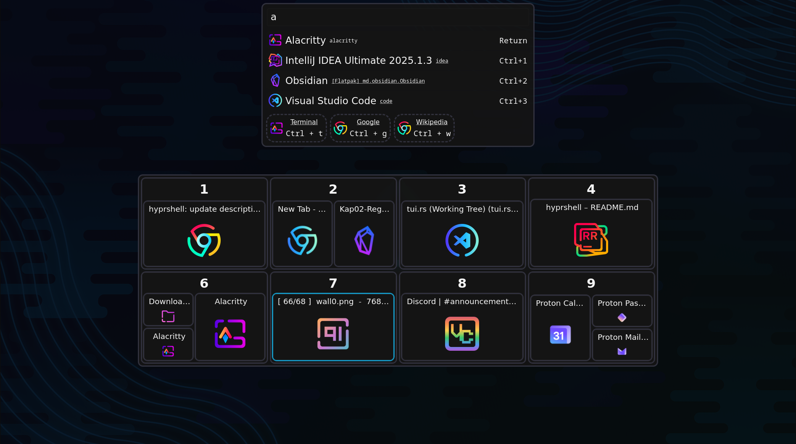

# Hyprshell

[](https://crates.io/crates/hyprshell) [](https://docs.rs/hyprshell)



## Overview

Hyprshell _(previously hyprswitch)_ is a Rust-based GUI designed to enhance window management in [Hyprland](https://github.com/hyprwm/Hyprland).
It provides a powerful and customizable interface for switching between windows using keyboard shortcuts and GUI.
The application also includes a launcher for running applications, doing calculations, etc.

## Features

- **Window Switching**: Switch between windows using keyboard shortcuts in a GUI.
- **Customizable Keybindings**: Define your own keybindings for window switching and GUI interactions.
- **Config**: Interactive [config file](./CONFIGURE.md) generation for easy setup.
- **Launcher Integration**: Launch applications directly from the GUI, sorted by usage frequency.
- **Theming**: Customize the GUI appearance (gtk4) using [CSS](./CONFIGURE.md).
- **Sorting and Filtering**: windows sorted by position, can be filtered by class, workspace, or monitor.
- **Dynamic Configuration**: Automatically reloads configuration/style changes without restarting the application.

## Installation

[](https://repology.org/project/hyprshell/versions)

### From Source

gtk4 and [gtk4-layer-shell](https://github.com/wmww/gtk4-layer-shell)[1.1.1] must be installed

```bash
cargo install hyprshell
```

### Arch Linux

```bash
paru -S hyprshell
# or
yay -S hyprshell
```

### NixOS

This repository contains a `flake` and a `home-manager` module for configuration.

More information can be found in the [NixOS](NIX.md) section.

## Usage

Run `hyprshell --help` to see available commands and options.

### Config generation

To generate a default configuration file, run:

```bash
hyprshell config generate
```

This launches an interactive prompt to set up your configuration.
The generated file will be located at `~/.config/hyprshell/config.ron`.

If you want to modify these settings, look at the [Documentation](CONFIGURE.md) for the config file.

### Config validation

To validate your configuration file, run:

```bash
hyprshell config check
```

This checks for any syntax errors or issues in your configuration file and shows a `explanation` of how to use hyprshell.

### Initialization

Enable the systemd service (generated with `hyprshell config generate`) [recommended]:

```bash
systemctl --user enable --now hyprshell.service
```

Or add the following to your Hyprland configuration (`~/.config/hypr/hyprland.conf`):

```ini
exec-once = hyprshell run &
```


### Env Variables

- `HYPRSHELL_NO_LISTENERS`: Disable all config listeners (config file, css file, hyprland config, monitor count)
- `HYPRSHELL_NO_ALL_ICONS`: Don't check for all icons on fs and just use the ones provided by the `gtk4` icon theme.
- `HYPRSHELL_RELOAD_TIMEOUT`: Set the timeout for reloading the config file in milliseconds (default: `1500`).
- `HYPRSHELL_LOG_MODULE_PATH`: Add the module path to each log message. (use with -vv)

### Feature Flags

- default: `["toml_config", "generate_config_command", "launcher_calc", "debug_command"]`
- generate_config_command: Adds the `hyprshell config generate` command to interactively generate a config file.
- toml_config: Adds support for a toml config file.
- launcher_calc: Adds support for the calc plugin in the launcher.
- debug_command: Adds the `hyprshell debug` command to debug icons in the window mode.
- config_check_is_default: Adds a command to check if the loaded config is equal to the default config. Also diables loading of configs without all values.
